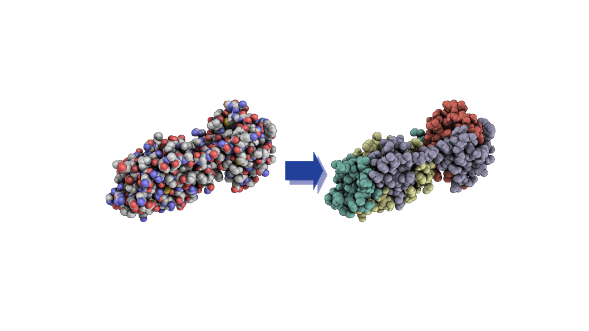

# Coarse-grained (CG) structures of SARS-CoV-2 related proteins 

This is a data repository of  Coarse-grained structures of SARS-CoV-2/COVID-19 related biomolecules.
These CG structutres are generated from [DSGPM](https://github.com/rochesterxugroup/DSGPM) neural network model. 

Please note that non-bonded protein chains/segments are coarse-grained separately. Each structure contain multiple mappings with different resolutions. Furthermore, HETAM entries of the original PDB files are removed.

## Available Structures
| PDB ID      | Segments     | No. of mappings     |
| :-------------: | :----------: | :-----------: |
| 1r42 | Whole structure   | 20    |
| 1r4l  | Whole structure| 20 |
| 2ajf| SPIKE| 18|
|2fe8 |CHAIN A  |24 |
| | CHAIN B| 23|
| | CHAIN C| 24 |
|4ow0 | Whole structure| 12 |
|6lu7 | Whole structure | 15 |
|6lxt | CHAIN A| 15 |
| |CHAIN B | 15 |
| |CHAIN C| 15 | 
| 6m03 | Whole structure | 7 |
| 6m17 | CHAIN A| 16|
| | CHAIN C| 16 |
| | CHAIN E | 12 |
| | CHAIN F| 12|
|6m71 | NSP7  | 10 |
| |NSP8 | 15 |
|6vw1 |RBD | 20 |
|6w41 | Whole structure | 17 |
|6y2f | Whole structure| 9 |
|6y2g | Whole structure | 17 |
| 7bv1| NSP7 | 10|
| |NSP8 | 19 |
|7bv2 | NSP7| 10 |
| | NSP8| 17|
| | PRIMER| 6 |
| |TEMPLETE | 6 |

## Funding 
These structures are generated as a milestone of the research project proposed for the [MOLSSI Seed-Fellowship](https://molssi.org/2020b-seed-software-fellows/) (Fellowship agreement No.480388) supported by the National Science Foundation.


## For Citations 

If you use these models or our model to generate CG mappings, please cite our [paper](https://doi.org/10.1039/D0SC02458A)


```
@Article{D0SC02458A,
author ="Li, Zhiheng and Wellawatte, Geemi P. and Chakraborty, Maghesree and Gandhi, Heta A. and Xu, Chenliang and White, Andrew D.",
title  ="Graph neural network based coarse-grained mapping prediction",
journal  ="Chem. Sci.",
year  ="2020",
pages  ="-",
publisher  ="The Royal Society of Chemistry",
doi  ="10.1039/D0SC02458A",
url  ="http://dx.doi.org/10.1039/D0SC02458A",
abstract  ="The selection of coarse-grained (CG) mapping operators is a critical step for CG molecular dynamics (MD) simulation. It is still an open question about what is optimal for this choice and there is a need for theory. The current state-of-the art method is mapping operators manually selected by experts. In this work{,} we demonstrate an automated approach by viewing this problem as supervised learning where we seek to reproduce the mapping operators produced by experts. We present a graph neural network based CG mapping predictor called Deep Supervised Graph Partitioning Model (DSGPM) that treats mapping operators as a graph segmentation problem. DSGPM is trained on a novel dataset{,} Human-annotated Mappings (HAM){,} consisting of 1180 molecules with expert annotated mapping operators. HAM can be used to facilitate further research in this area. Our model uses a novel metric learning objective to produce high-quality atomic features that are used in spectral clustering. The results show that the DSGPM outperforms state-of-the-art methods in the field of graph segmentation. Finally{,} we find that predicted CG mapping operators indeed result in good CG MD models when used in simulation."}
```
